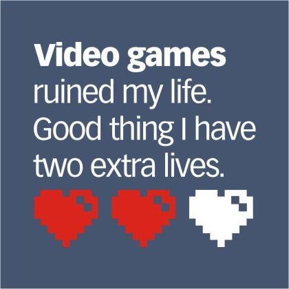

# קורס פיתוח משחקי מחשב
## אוניברסיטת אריאל, המחלקה למדעי המחשב, סמסטר א ה'תשפ"ב

הקורס כולל שני נושאים עיקריים:

* תהליך העיצוב והפיתוח של משחקים ומשחקי-מחשב.
* תיכנות משחקים בשפת סי שארפ ומנוע יוניטי. 

שימו לב: כדי לצפות במצגות, צריך לשבט את כל המאגר למחשב שלכם:

    git clone https://github.com/gamedev-at-ariel/gamedev-5782.git

להיכנס לתיקיה של השבוע המתאים, 
ולפתוח את הקובץ
`slides.html`
בדפדפן כלשהו.

לפרטים נוספים על הקורס ראו:

* [סילבוס](syllabus.pdf)

* [חוקי צבירת הנקודות בקורס](grade-rules.md)

* [תקנון היושר בהגשת מטלות](https://www.ariel.ac.il/wp/cs/wp-content/uploads/sites/88/2020/08/Guidelines-for-Academic-Integrity.pdf)

* [למי הקורס **לא** מתאים](disclaimer.md)

* [דרישות חומרה ותוכנה](hardware.md)

* [משחקונים שפיתחו סטודנטים שלמדו את הקורס בעבר](https://sites.google.com/view/gamedev-at-ariel)

* [דוגמאות קוד להרצאות](../../../)

* [איפה מוצאים משחקים בחינם](free-games.md)

* [איפה מוצאים נכסים בחינם](free-assets.md)

* [כנסים בינלאומיים שבהם אפשר להציג את המשחקים שלכם](conferences.md)

* [קורסים אחרים בארץ ובעולם](other-courses.md)

## תודות
הקורס פותח בעזרתם של הסטודנטים: מעוז גרוסמן, מיכאל למברגר, אור הדר וגיא אנקרי.
חלק מחומרי הלימוד נכתבו ע"י חן אוסטרובסקי, אינה גריגור, ואביהוא אושרי.

חלק מהחומר על יוניטי נלמד מקורסים ביודמי: [Unity 2D](https://www.udemy.com/course/unitycourse/learn/lecture/10248514),  [Unity 3D](https://www.udemy.com/course/unitycourse2/learn/lecture/8859276),  [Unity RPG](https://www.udemy.com/course/unityrpg/learn/lecture/14593312).

[התמונה למטה מאתר reddit](https://www.reddit.com/r/gaming/comments/84884e/video_games_ruined_my_life/).

